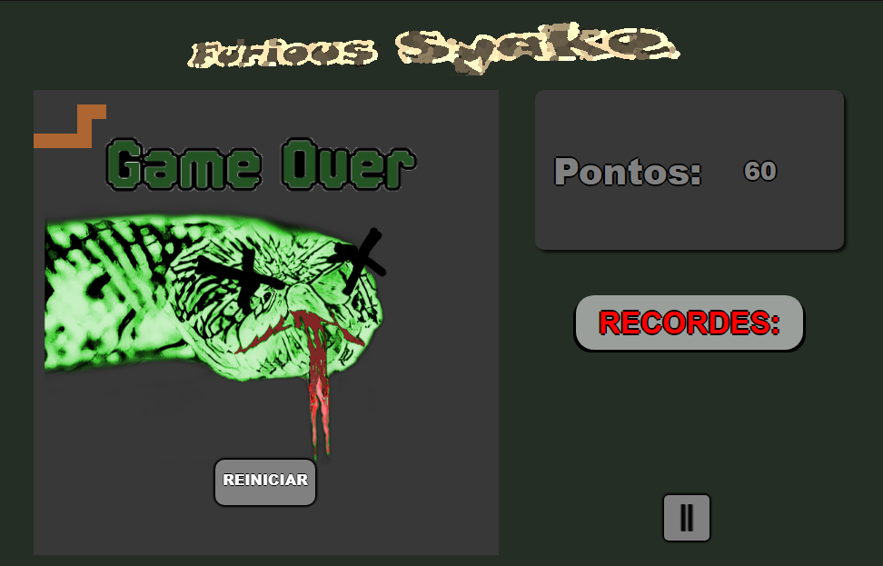

# My Snake Game :snake:

Desafio  - Digital Innovation One (DIO)

- Após apresentação do projeto 'Jogo da Cobrinha' em JavaScript, o desafio consiste em aplicarmos os conceitos apresentados para fazer nosso próprio Jogo da Cobrinha.
- Este é o meu projeto, baseado na apresentação deste desafio

#### Este projeto contém as seguintes funcionalidades:

- Pontuação

- Limite de mobilidade da cobra somente dentro da caixa

- Bater Recordes e salvar dados dos recordistas em LocalStorage

- Mostrar dados dos recordistas até o quarto lugar

- Animações de metas

- Função comer o próprio rabo (meta com dificuldade pra ser alcançada, pois fica muito próximo de perder o jogo)

- Botão pause, reiniciar

- Animação de Game Over

  

  